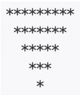

# Quiz - Week 3

1. [NLTK] text6에서 pt를 포함하는 단어 리스트를 출력하는 코드를 작성하세요.

2. [NLTK]    nltk.book 텍스트들을 순회하며 각 코퍼스에서 what, when, where, who, why, which의 빈도수를 출력하는 코드를 작성하세요.
    - 단, 단어는 모두 소문자화함.
    - 전체 코드가 하나의 루프 안에 존재해야 함.
    - 프린트는 다음의 형식으로 맞춰야 함
    `텍스트1: what=3번, when=4번, where=6번, who=3번, why=11번, which=44번`
    
3.  팩토리얼이란 다음과 같다.
     
     1! = 1
     2! = 1 * 2
     3! = 1 * 2 * 3
     ...
     n! = 1 * 2 *3 * ... * n
 
    팩토리얼을 구한 뒤, 결과값의 맨 마지막 자리에서 시작해서 처음으로 0이 아닌 숫자가 나올 때까지 0의 개수를 구하는 함수를 만드시오.
    예: 80000300 => 2개
 
    - 입력값= n
    - 출력값= 결과값, 0 개수
    
4. 두 수의 최대공약수와 최소공배수를 구하는 함수를 짜시오. (함수를 각각 만들어서 활용해도 됨)
 
    - 공약수(common divisor)란 두 수 이상의 여러 수의 공통된 약수를 의미합니다. 최대공약수(GCD)란 두 수 이상의 여러 수의 공약수 중 최대인 수를 가리킵니다.
    - 두 수의 최소공배수는 두 수에 서로 공통으로 존재하는 배수 중 가장 작은 수를 뜻합니다.
    - 힌트: 최소공배수 = (0이 아닌) 두 수의 곱 / 최대공약수
    
5. 다음과 같은 규칙을 따르는 프로그램이 있다고 하자. 
    
    주어진 수가 10보다 작다면 앞에 0을 붙여 두 자리 수로 만들고, 각 자리의 숫자를 더한다.
    그 다음, 주어진 수의 가장 오른쪽 자리 수와 앞에서 구한 합의 가장 오른쪽 자리 수를 이어 붙이면 새로운 수를 만들 수 있다.
 
    예를 들어, 26은 2+6 = 8이다. 새로운 수는 68이다. 6+8 = 14이다. 새로운 수는 84이다. 8+4 = 12이다. 새로운 수는 42이다. 4+2 = 6이다. 새로운 수는 26이다. 26은 4번만에 원래 수로 돌아올 수 있다. 따라서 26의 사이클의 길이는 4이다.
 
    n이 주어졌을 때, n의 사이클의 길이를 구하는 프로그램을 작성하시오.
 
    - 입력: n (n은 0보다 크거나 같고, 99보다 작거나 같은 정수)
    - 출력: n의 사이클 길이
    
6. 다음 조건에 맞게 별찍기 프로그램을 작성하시오.
 
    [ 조건 ]
    - 첫째 줄에는 별 2×N-1개, 둘째 줄에는 별 2×N-3개, ..., N번째 줄에는 별 1개를 찍는다.
    - 별은 가운데를 기준으로 대칭이어야 한다.
 
    - 입력값: n
    - 출력값: 첫째 줄부터 N번째 줄까지 차례대로 별을 출력
 
    - (출력 예시) 다음은 n = 5 일때 출력 예시이다. 참고해서 프로그램을 작성하시오.
    