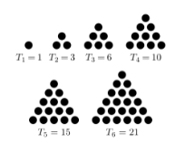

# Quiz - Week 4. NLTK Corpus

1. CFD를 이용하여 nltk.book의 텍스트별 빈도수를 만들고 wh-words의 빈도수를 출력하시오.
    `wh_words = what, why, when, where, which`
    
2. gutenberg에서...
    - 파일 중 모음(a, e, i, o, u)으로 시작하는 파일을 골라
    - 단어를 가져오되 숫자, 문장부호를 모두 제거하고
    - 모든 단어를 하나의 스트링으로 출력하시오.
    
3.  브라운에서 각 장르별 hapax의 개수를 cfd를 이용하여 구하시오.

## 그외
4. 다음과 같은 규칙을 따르는 프로그램이 있다고 하자. 
 
    - 주어진 수가 10보다 작다면 앞에 0을 붙여 두 자리 수로 만들고, 각 자리의 숫자를 더한다.
    - 그 다음, 주어진 수의 가장 오른쪽 자리 수와 앞에서 구한 합의 가장 오른쪽 자리 수를 이어 붙이면 새로운 수를 만들 수 있다.
 
    - 예를 들어, 26은 2+6 = 8이다. 새로운 수는 68이다. 6+8 = 14이다. 새로운 수는 84이다. 8+4 = 12이다. 새로운 수는 42이다. 4+2 = 6이다. 새로운 수는 26이다. 26은 4번만에 원래 수로 돌아올 수 있다. 따라서 26의 사이클의 길이는 4이다.
 
    n이 주어졌을 때, n의 사이클의 길이를 구하는 프로그램을 작성하시오.
 
    - 입력: n (n은 0보다 크거나 같고, 99보다 작거나 같은 정수)
    - 출력: n의 사이클 길이
    
5. 다음은 n이 각각 1,2,3,4,5,6일 때의 삼각수를 그림으로 나타낸 것이다.
    
    
    
    양의 정수가 세 삼각수의 합으로 나타낼 수 있는지를 구하는 프로그램을 작성하시오.

    - 입력: n은 1이상 1000이하의 양의 정수
    - 출력: n을 세 수의 합으로 나타낼 수 있으면 이 세 삼각수를 오름차순으로 출력, 세 수의 합으로 나타낼 수 없으면 –1을 출력 (단, 해가 여러 개 있을 경우 세 수의 최소 값이 가장 작은 것을 출력)
    
    [ 입출력 예시 ]
    입력 1) 10           출력 1) 1 3 6
    입력 2) 6            출력 2) -1
 
 
    (힌트) n번째 삼각수 = n(n+1)/2
    
6. 소인수분해(영어: prime factorization, integer factorization)는 1보다 큰 자연수를 소인수(소수인 인수)들만의 곱으로 나타내는 것 또는 합성수를 소수의 곱으로 나타내는 방법을 말한다.

    예: 15 = 1 * 3 * 5 (소인수 = [1, 3, 5])
        8 = 2 * 2 * 2 (소인수 = [1, 2])
 
    무작위 수 n이 주어졌을 때 n의 소인수를 출력하는 함수를 만드시오.
    (단, 위의 예에서 8과 같은 경우는 2가 한 번만 출력되어야 함.)

    - n의 무작위 생성을 위해 다음의 코드를 참고하세요.
        ```sh
        import random
        random.randint(1, 300)
        ```
        
        